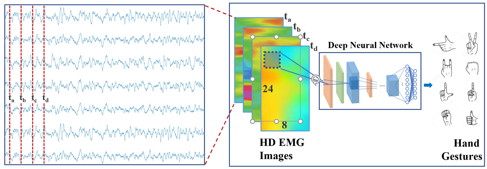
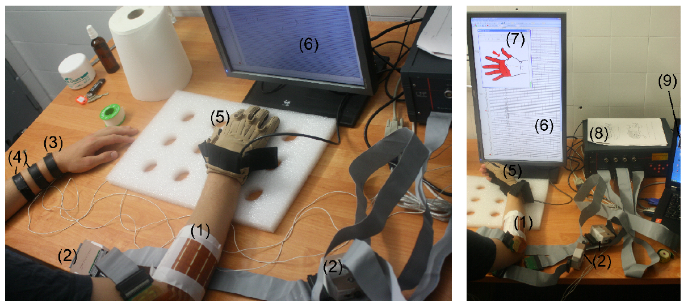
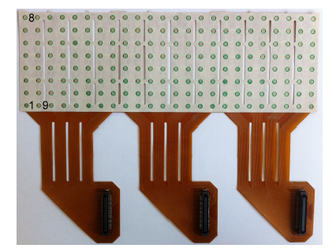

# CNN-HD-sEMG-Classifier
<p align="center">

<p>
This is an implementation of gesture recognition using a light weight convolutional neural network (CNN) - MobilenetV2. The recognition is based on high-density surface electromyography (HD-sEMG) signals from two datasets: CSL HD-sEMG and ICE Lab HD-sEMG.

In this implementation, we process the 192 channels of HD-sEMG data into an 8 by 24 image to fed into the neural network for classification.


## Dataset
### ICE Lab Dataset
- Data Collection
    - Data acquisition was conducted with the OT Bioelettronica's Quattrocento amplifier at 2560 samples per second with three surface EMG electrode grids (placed on the subject's dominate forearm) with 10mm spacing in an 8 by 8 arrangement
    - The subject perfrmed the 7 gesture in sequence 5 times. Each gesture was performed for 5 seconds.
- Gestures
    - This dataset include 7 hand and wrist gestures
        - No movement, 
        - wrist supination, 
        - wrist pronation, 
        - hand close, 
        - hand open, 
        - wrist flexion, 
        - wrist extension


### CSL HD-sEMG Dataset
-  Introduction
    - [Cognitive Systems Lab (CSL)](https://www.uni-bremen.de/csl/)  investigates the usefulness of inertial sensing (IMU) and electromyography (EMG) for the detection of gestures 
    - Inertial sensors detect movement through acceleration and yaw rate sensors
    - The group’s site provides two sets of data
        - [mmGest](https://www.csl.uni-bremen.de/cms/images/documents/publications/GeorgiAmmaSchultz_RecognizingHandAndFingerGesturesWithIMUBasedMotionAndEMGBasedMuscleActivitySensing.pdf) - IMU and EMG data from 5 different subjects in 5 separate sessions
        - [csl-hdemg](pdfs/CSL-HD-sEMG.pdf) - high-density EMG recordings of finger movements
- Data Collection
    - EMG data for 5 subjects
    - Each subject performed 5 sessions recorded on different days
27 gestures in each gesture set, 10 trials for each gesture per session
One of those gestures is an “idle” gesture, which was repeated for 30 trials
    - Sampling Rate - 2048 Hz
    - Data saved in a 192 x N matrix
    - Every row is a channel

*Sensor Placement images from CSL-HD sEMG paper*[[1]](#1)
#### Electrodes
- Every 8th channel does not contain meaningful data due to differential amplification in the bipolar recordings and should be ignored
1st channel is the differential signal of electrodes 1 and 2, 2nd channel is the differential channel of electrodes 2 and 3, etc ...
- Bipolar electrode arrangement with differential amplifier
- Suppresses signals common to two electrodes
- Essentially, differential amplification subtracts the potential voltage at one electrode with the potential voltage at another and then amplifies the difference


    


    *Electrodes array images from CSL-HD sEMG paper*[[1]](#1)
#### Electrodes Placement
- Electrodes 1, 9, 17, ..., 185 are located near the proximal end
- Electrodes 8, 16, ..., 192 are located on the distal end


## Quick Start
### Configuration
| Setting        | Description           | Options  |
| ------------- |:-------------:| -----:|
| Epoch      | Training Epochs | Any integers |
| learning_rate      | Optmizer learning rate, default is 3e-4 for AdamW optimizer    |   Any integers or floats |
| T_max | Maximum number of iterations. Usually is the same number as epoch      |    Any integers |
| input_width | The input image width. The mutiplication of the width and the height should equal to 192      |    Any integers |
| input_height | The input image height. The mutiplication of the width and the height should equal to 192      |    Any integers |
| channel | The input channel, this option usually is 1 for sEMG data. For Image data usually is 3 because image has R,G,B three channels.      |    Any integers |
| batch_size | A number of samples in one batch. Reduce this number if occur memory issue      |    Any integers |
| num_workers | Number of threads      |    Any integers |
| data_path | The relative/absolute directory path for the data.       |    Any strings |
| dataset | The name of datasets      |    "CSL" or "ICE" |
| fold | number of fold for K fold validation      |    Any integer |
| weight_decay | Weight decay coefficient for optimizer. Weight decay improves the generalization performance of a machine learning model by preventing overfitting      |    Any integers or floats |
| model_save | The directory path for saving the model      |    Any strings |
| finetune | finetuning      |    true or false |
| pretrain_model_path | The directory path for pretrain model weight      |    Any strings |
| label_smoothing | Label smoothing is a regularization technique that can improve the generalization and robustness of a model by preventing it from becoming overly confident or overfitting to the training data.      |    A float in [0.0, 1.0] |
| model_width | Mobilenet block expansion radio, the less he number, the lower the computation and storage usuage       |    A float in [0.0, 1.0] |

### Dependency
- python=3.9
- torchvision
- pytorch-cuda=11.8
- pytorch
- torchaudio
- matplotlib
- scikit-learn
- tqdm

### Quick dependency installation
```
conda env create -f environment.yml
```
### Training from scratch
```
python train.py
```
### Testing sEMG data with label of 0
```
python test.py
```

<!-- ## Experiment Result -->

## Experiment Result
### Ice Lab Dataset
| Network Config        |Parameters (M) |      MACs (M)    | Accuracy (%)  |
| ------------- |:-------------:| -----:|----:|
| Model Width: 1      | 2.314M |  18.303M  | 99.197 |
| Model Width: 0.7      | 1.712M |  12.967M  | 98.856 |
| Model Width: 0.4      | 1.110M |  7.632M  | 97.924 |
| Model Width: 0.2      | 0.8K |  4.964M  | 97.252 |

## Relative Project
[Toward Robust High-Density EMG Pattern Recognition using Generative Adversarial Network and Convolutional Neural Network Implementation](https://github.com/MIC-Laboratory/IEEE-NER-2023-RoHDE) (IEEE NER'23)


[EffiE: Efficient Convolutional Neural Network for Real-Time EMG Pattern Recognition System on Edge Devices](https://github.com/MIC-Laboratory/IEEE-NER-2023-EffiE) (IEEE NER'23)


[Real-time Bionic Arm Control Via CNN-based sEMG Recognition](https://github.com/MIC-Laboratory/Real-time-Bionic-Arm-Control-via-CNN-on-Sony-Spresense) (Sony Spresense Developer Challenge 2022 Grand Price)

## References
<a id="1">[1]</a> 
Amma, C., Krings, T., Böer, J. and Schultz, T., 2015, April. Advancing muscle-computer interfaces with high-density electromyography. *In Proceedings of the 33rd Annual ACM Conference on Human Factors in Computing Systems* (pp. 929-938).